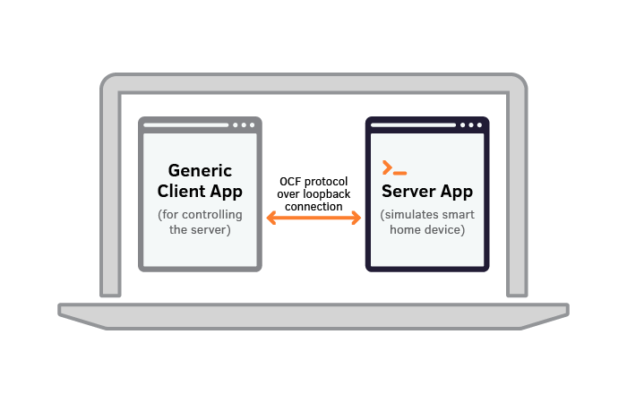
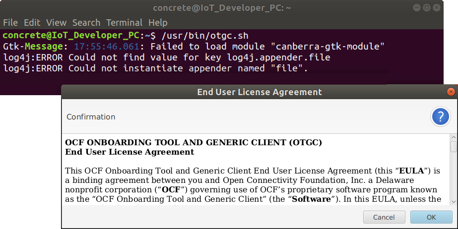
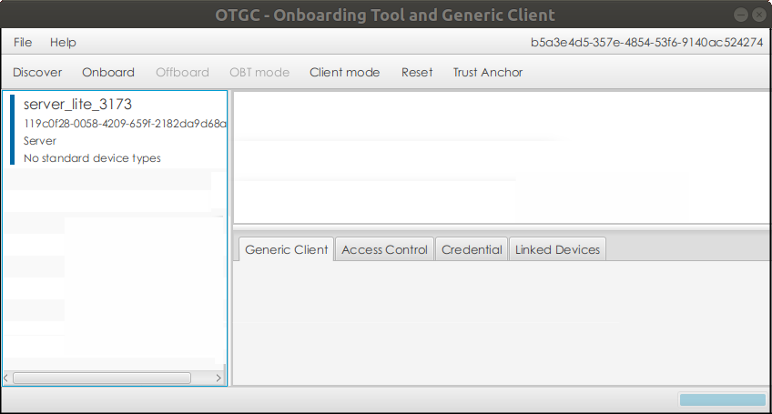
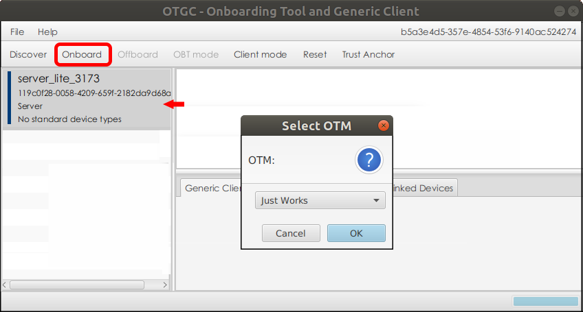
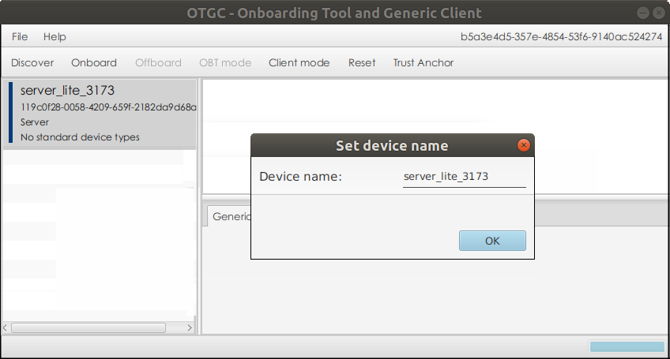
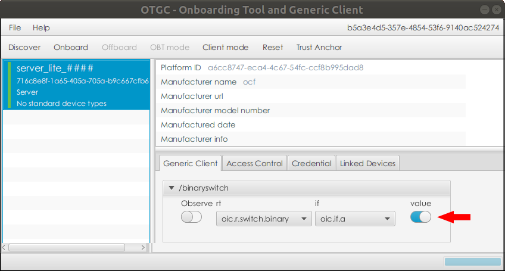

## Introduction
This guide will show you how to download, build, and run two simulated devices on the same Linux PC:

* The **server**, a command-line app, simulates a smart home device such as a smart switch.
* The **client**, a GUI app, controls the smart device. While this example uses a Linux client application, the client typically runs on a smart phone.

The two apps talk to each other over a loopback connection, using the OCF protocol.





## Requirements

To carry out this tutorial, you will need the following:

* A Debian-based Linux PC (e.g., Ubuntu), with an internet connection.

## Install and Run the Server App

1. On the development PC, open a terminal.
2. Download source and set up the IoTivity-Lite environment by running this command, which takes several minutes to complete:
  ```
  curl https://openconnectivity.github.io/IOTivity-Lite-setup/install.sh | bash
  ```
  Alternatively, you can download the install.sh script, review and run it from any location.

3. Generate code for the server app by running these commands:
  ```
  cd ~/iot-lite/
  ./gen.sh
  ```

  This script runs the DeviceBuilder app with a default JSON configuration file that can be edited to specify the capabilities of your actual device.

4. Build and run the server app by running these commands:
  ```
  ./build.sh
  ./reset.sh
  ./run.sh
  ```
  The server device is now running. Leave this terminal window open. The server app is waiting for commands from the client app, which you’ll install next.

## Build and Run the Client App

The sample client application is called OTGC (Onboarding Tool and Generic Client). 
Build the Linux version by executing the script as described below:

1. On the development PC, open another terminal window.
2. Download and build the Linux OTGC client by running this command, which takes several minutes to complete:
  ```
  curl https://iotivity.github.io/otgc-linux/setup.sh | bash
  ```
  Troubleshooting: If the build process completes, but an error occurs, manually run the dpkg command from the setup.sh script.
  
  ```
  sudo dpkg -i ./otgc-linux/build/debian/out/otgc-3.0.0.deb
  #run only in the event of an error and substitute the version of otgc
  #that is available at this location (for example, the version number will
  #increment as new versions are created (e.g. otgc-3.0.0.deb))

  Note: Executing this command installs a Java enviroment.
  ```
3. Launch the Linux OTGC client by running this command:
  ```
  /usr/bin/otgc.sh
  ```
  

4. Click to OK to accept the End User License Agreement.

  

  OTGC starts and automatically scans all visible OCF (Open Connectivity Foundation) devices, listing them in the app's left-hand pane. In the screen above, the device found is called server_lite_3173.

5. For a clear view, locate and align both the terminal window that is awaiting incoming connections and the app window, so that both are visible.

  As you proceed with the remaining steps in this section, notice that each action taken in the client app generates console output in the terminal window that had been awaiting incoming connections. 
  This proves that you are controlling your smart home device:

  * Click to select the device listed in the left-hand pane, and click the Onboard button.

    

    The Select OTM (Ownership Transfer Method) dialog box pops up. Any of the available security methods should work.

  * OK the Selected OTM in the dialog box.

   
    
 
  
    As device ownership is transferred, the Select OTM dialog box closes and is replaced by the Set Device Name dialog box.

    Change the device name, if you wish. Click OK to close the dialog box.

    In this example, the device name is shown as server_lite_3173.

    The bar to the left of the device will turn green indicating that the device is now owned by your copy of OTGC.

  * Click to reselect the device in the left-hand pane. In the Generic Client tab, toggle the Value switch on and off. You should see the monitor window for the server device indicating true and false as you change the state of the switch.

  

6. When you are done controlling the switch, click the offboard button to relinquish your ownership and return the security state to Ready For Onboarding Transfer Method (RFOTM)

7. Quit the client app and then press Ctrl-C in the server terminal to stop the server device.

## Customize the Code

IoTivity provides a tool for automatically generating server code as a significant head start for your software development. The code generation tool works from a JSON file created by you that describes the capabilities of your device. The server code you compiled and ran in this tutorial began from the file named example.json, found in the ~/iot-lite/ directory on your development PC.

The steps below will show you how to make a simple change to the JSON file, recompile, and run the server and client. You can then see how the changes you made to the server’s capabilities in the JSON file are reflected in the client app.

1. On your development PC, back up the example.json file:
  ```
  cd ~/iot-lite/
  cp example.json example.json.bak
  ```

2. Open the example.json file in your preferred editor. This can be easily done with the ./edit_input.sh script or you can open the example.json file with your favorite text editor.
3. Add a dimming resource as indicated below. The example.json file will now have two resources: binary switch and dimming. The other resource is for the device platform and will not be displayed in the client application.
  ```
  [
    {
      "path" : "/binaryswitch",
      "rt"   : [ "oic.r.switch.binary" ],
      "if"   : ["oic.if.baseline", "oic.if.a" ],
      "remove_properties" : [ "range", "step" , "id", "precision" ]
    },
    {
      "path" : "/dimming",
      "rt"   : [ "oic.r.light.dimming" ],
      "if"   : ["oic.if.baseline", "oic.if.a" ],
      "remove_properties" : [ "range", "step", "value" , "id" , "precision" ]
    },
    {
      "path" : "/oic/p",
      "rt"   : [ "oic.wk.p" ],
      "if"   : ["oic.if.baseline", "oic.if.r" ],
      "remove_properties" : [ "n", "range", "value", "step", "precision", "vid"  ]
    }
  ]
  ```
  Save your changes.

4. While still in the ~/iot-lite/ directory, generate the server code, build, and run:
  ```
  ./gen.sh
  ./build.sh
  ./reset.sh
  ./run.sh
  ```
5. Run the client app:
  ```
  /usr/bin/otgc.sh
  ```
6. As you observed in Step 5 of the **Install and Run the Client App** section above, notice how the console output in the server terminal responds to actions taken in the client app:

  * Click to select the device and click the Onboard button.
  * Select PKI and OK in OTM dialog box.
  * Change the device name, if you wish, and click OK to close the Set Device Name dialog box.
  * Click to reselect the device. In the Generic Client tab, toggle the Value switch on and off.
    You can also now enter a dimming value in the text box for the new dimming control. Hit Tab to change the value on the server. You should see the new   value in the server window.
  * Offboard the server by selecting it and clicking on the offboard button.
  * Quit the client app and then press Ctrl-C in the server terminal to exit the process.

## Run on Separate Devices

Now that you’ve run a quick simulation on your own development PC and experienced the basic flow, 
you can get a better picture of IoTivity capabilities by running it on a Raspberry Pi board, 
where you can control and read its status from the same OTGC Linux application or you can download and run OTGC on an Android phone or tablet.

Visit the next [Getting Started guide using a Raspberry Pi Kit](/GS_Rasp).

