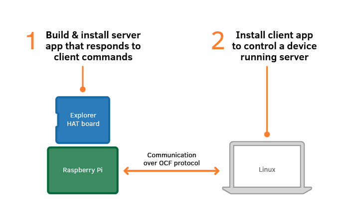

## Introduction

This Getting Started guide will show you how to download, build and run IoTivity microcontroller apps, featuring two-way communication between a Linux or Android Client (controller) and a microcontroller board with built-in Wi-Fi. For this particular example, we will use the TTGO ESP32 board with a full-color TFT display and two onboard switches. Besides being an amazing board for all sorts of demos, this board is inexpensive and includes everything needed for simple demonstrations and quite complex projects.


The following graphic shows how the client and server communicate.

* The server, a command-line app, runs on a smart home device, such as a smart switch or smart thermostat, represented by the ESP32 TTGO board.
* The client, a GUI app, controls the smart device from a Linux computer or Android tablet.

The two apps talk to each other over Wi-Fi, using the OCF (Open Connectivity Foundation) protocol.



To carry out this tutorial, you will need the following:

* ESP32 TTGO board with color TFT display
* A full computer (Linux, Windows or MacOS) for software development
* Linux computer or Android tablet on the same network as the ESP32 TTGO to run the client controller software

Now let's install the development software and build an actual Internet of Things hardware implementation using the OCF system.

##Installing Prerequisites

First, open a terminal window in Ubuntu or some other version of Linux.

* If curl isn't already installed, install it: sudo apt-get install curl
* If git isn't already installed, install it: sudo apt-get install git
* set up  user.name and user.email for git (if you get a request when trying to use git)
	- git config --global user.name "Your Name"
	- git config --global user.email "your email address"
* Install libraries:
	- sudo apt install -y git wget flex bison gperf python3 python3-pip python3-setuptools \
	  python3-serial python3-click python3-cryptography python3-future python3-pyparsing \
	  python3-pyelftools cmake ninja-build ccache libffi-dev libssl-dev libusb-1.0-0
* Make sure we have access to the serial port
	- sudo usermod -a -G dialout <username> (If this doesn't work, you might need to substitute "tty" for "dialout")
	- Enter the command "groups" (to verify if you have been added to the dialout and/or tty groups)
* This may be necessary to manage different versions of Python:
   - sudo apt-get install python3-venv
    	- Check with: ls -al /usr/bin/python
    	- Set with: sudo ln -s /usr/bin/python3 /usr/bin/python

##Set up IoTivity-lite for ESP32

Use the following commands in the terminal window:
* cd ~
* curl https://openconnectivity.github.io/IOTivity-Lite-setup/install-master.sh | bash
* Until the above command installs the latest version, we need to replace the IoTivity installation with the following:
	- cd iot-lite
	- rm -rf iotivity-lite
	- Need to clone iotivity-lite recursively (git clone --recursive https://github.com/iotivity/iotivity-lite.git)

## Install Visual Studio Code

Download and follow the instructions here: https://code.visualstudio.com/download

Once Visual Studio is installed, install the following extensions:

* Install the following extensions in VS Code
	- C/C++ Microsoft
	- CMake Extension Pack
	- GitHub Pull Requests and Issues
	- PlatformIO IDE
	- OpenAPI
* Restart VS Code


* Choose code control button in VS Code and Initialize repository (to work with git)
	- stage changes
	- commit changes
* Link with github using the publish button

## Install the Espressif ESP32 Tools

This document adds a few things to the process described here: https://github.com/iotivity/iotivity-lite/tree/master/port/esp32


###Ubuntu

Type the following the the terminal window:

* Standard install
	- cd ~
	- git clone --recursive https://github.com/espressif/esp-idf.git 
	- Set to this specific version
		- (cd esp-idf && git checkout 457ce080aec9811faee26a1ea5293fff17049fee && git submodule init && git submodule update)
	- ./esp-idf/install.sh
	- . ./esp-idf/export.sh
* Or if using PlatformIO espressif install
	- cd ~/.platformio/packages/framework-espidf
	- ./framework-espidf/install.sh
	- . ./framework-espidf/export.sh
* jump to the common steps below

###Windows 
(note that the windows steps are from Jozef and I have not tested them yet)

* [install] (https://docs.espressif.com/projects/esp-idf/en/latest/esp32/get-started/windows-setup.html)
* Please select master repository and install it to iotivity-lite/port/esp32/esp-idf
* Install CMake, Bash for find
* Set PATH env to cmake, python
* Run esp-idf commandline
* jump to the common steps below

###Common steps 

Type the following in the terminal window:

* Change to the directory where you want to build a project
* idf.py set-target esp32
* idf.py menuconfig // set wifi (This will bring up a text-based GUI application where you need to set SSID and SSID password under the IoTivity menu item. Exit and save.)
* Apply patches
	- NOTE: When applying the patches below, you may be prompted with "*** Please tell me who you are." If so, enter any email and name using the specified commands. Then try the patches again.
	- If using PlatformIO version of espressif
		- ( cd ~/.platformio/packages/framework-espidf/components/mbedtls/mbedtls && git am ~/iot-lite/iotivity-lite/patches/mbedtls_*.patch )
		- ( cd ~/.platformio/packages/framework-espidf && find ~/iot-lite/iotivity-lite/port/esp32/patches/esp-idf/ -type f -name '*.patch' -exec patch -p1 -i {} \; )
		- ( cd ~/.platformio/packages/framework-espidf/components/lwip/lwip && find ~/iot-lite/iotivity-lite/port/esp32/patches/lwip/ -type f -name '*.patch' -exec patch -p1 -i {} \; )
	- If using standard espressif install in home directory
		- ( cd ~/esp-idf/components/mbedtls/mbedtls && git am ~/iot-lite/iotivity-lite/port/esp32/patches/mbedtls/*.patch )
		- ( cd ~/esp-idf && find ~/iot-lite/iotivity-lite/port/esp32/patches/esp-idf/ -type f -name '*.patch' -exec patch -p1 -i {} \; )
		- ( cd ~/esp-idf/components/lwip/lwip && find ~/iot-lite/iotivity-lite/port/esp32/patches/lwip/ -type f -name '*.patch' -exec patch -p1 -i {} \; )

###Tool Chain

Type the following in the terminal window:

* idf.py build
* idf.py erase_flash (optional if you want to erase flash on the esp32)
* idf.py -p (PORT) flash monitor (on my machine, the PORT is /dev/ttyUSB0)
* Note: If you are logging in to an account fresh and you’ve already done the above steps, it seem you need to do the following to compile and upload it successfully
	- cd ~/iot-lite/iotivity-lite/port/esp32
	- . ./esp-idf/export.sh
	- idf.py build
	- idf.py erase_flash (optional)
	- idf.py -p (port) flash monitor
		- Note: When in monitor mode, you can use Ctrl + ] to break out (like Ctrl + C)

* If using PlatformIO espressif install and tool chain
	- cd ~/.platformio/packages/framework-espidf
	- ./framework-espidf/install.sh
	- . ./framework-espidf/export.sh

##Install Utility Scripts and Examples

- cd ~
- curl https://openconnectivity.github.io/Project-Scripts/install.sh | bash
	- You will need to log out and log back in (or use source) to make sure the modified .bashrc is run. (source ~/.bashrc)
- curl https://raw.githubusercontent.com/openconnectivity/ESP32-Code/main/esp32/install.sh | bash

##Install Visual Studio Tool Chain

Type the following in the terminal window:

* You can then use the following process to build an esp32 project. I usually create a ~/workspace directory and cd ~/workspace
	- create_project.sh esp32test
	- cd esp32test
	- cp ~/ESP32-Code/IoTivity-lite/vscode-esp32-example/setup.sh .
	- ./setup.sh

* Install VS Code action buttons
	- Create a settings.json file in the hidden .vscode/ directory at the root of your project
	- put the following code in the settings.json file
			{
			    "actionButtons": {
			        "defaultColor": "yellow", // Can also use string color names.
			        "loadNpmCommands":false, // Disables automatic generation of actions for npm commands.
			        "reloadButton":"♻️", // Custom reload button text or icon (default ↻). null value enables automatic reload on configuration change
			        "commands": [
			            {
			                "name": "OCF Gen",
			                "singleInstance": false,
			                "command": "gen.sh", // This is executed in the terminal.
			            },
			            {
			                "name": "OCF Build",
			                "singleInstance": false,
			                "command": ". ~/esp-idf/export.sh && idf.py build", // This is executed in the terminal.
			            },
			            {
			                "name": "OCF Run",
			                "singleInstance": false,
			                "command": ". ~/esp-idf/export.sh && idf.py -p /dev/ttyUSB0 flash monitor", // This is executed in the terminal.
			            },
			            {
			                "name": "OCF Reset",
			                "singleInstance": false,
			                "command": ". ~/esp-idf/export.sh && idf.py erase_flash",
			            }
			        ]
			    },
			    "cmake.configureOnOpen": true
			}
	- Close and reopen VS Code to get the buttons to reload

##Tool Chain

You can use either the command line in a terminal window, or the Visual Studio Code editor to execute the commands.

###Command Line Tool Chain

Type the following in the terminal window:

* Once that is done, you can repeat the following commands to build the device
	- gen.sh (this will run DeviceBuilder to create the device described in the esp32test-config.json file)
	- build.sh (at least once after you login, you will need to do the following:)
		- cd ~/iot-lite/iotivity-lite/port/esp32
		- . ./esp-idf/export.sh
	- reset.sh (to set to RFOTM)
	- run.sh (this will upload the code to the esp32 and start the monitor mode so you can get some feedback)
		- NOTE: You can use Ctrl + ] to exit the monitor (This will stop feedback from the esp32 and get you back to the command line.)

###Visual Studio Code Tool Chain

Type the following in the terminal window:

* Once that is done, you can repeat the following commands to build the device
* Open Visual Studio Code
* Open the directory containing your project (created using create_project.sh (and possibly installing one of the examples)
* Use the following tool action buttons at the bottom of VS Code
	- OCF Gen (this will run DeviceBuilder to create the device described in the esp32test-config.json file)
	- OCF Build (this will compile the code)
	- OCF Reset (to clear the flash memory on the esp32 board and reset the board to RFOTM if necessary)
	- OCF Run (this will upload the code to the esp32 and start the monitor mode so you can get some feedback)
		- NOTE: You can use Ctrl + ] from within the "run" terminal to exit the monitor (This will stop feedback from the esp32 and get you back to the command line.)


## Build and Run the Client App (If you've already installed OTGC once, you can skip the installation here and jump to step 3.)

NOTE: The instructions below are for building and running the OTGC client application on Linux. Alternatively, you can run the Android version of OTGC on your smart phone or tablet. Get the installation package here. You can then just run it and skip the Linux OTGC installation in the steps below. If you run the Android app, you can basically follow the instructions from step 5 below. The circle icon will start the discovery process and should find the Emulator server.

The sample client application is called OTGC (Onboarding Tool and Generic Client). You'll download and build the binary with a script:

1. On the development PC, open another terminal window.
2. Download and build the Linux OTGC client by running this command, which takes several minutes to complete:

   ```bash
   curl https://openconnectivity.github.io/otgc-linux/setup.sh | bash
   ```

   Troubleshooting: If the build process finishes but an error occurs, manually run the dpkg command from the setup.sh script.

   ```bash
   sudo dpkg -i ./otgc-linux/build/debian/out/otgc-2.9.0.deb
   #run only in the event of an error and substitute the version of otgc
   #that is available at this location (for example, the version number will
   #increment as new versions are created (e.g. otgc-2.10.0.deb))
   ```

3. Launch the Linux OTGC client by running this command:

   ```bash
   /usr/bin/otgc.sh
   ```

4. Click to OK the End User License Agreement.
   OTGC starts and automatically scans all visible OCF devices, listing them in the app's left-hand pane.
5. Locate and align both the terminal window that is awaiting incoming connections (as well as the dimming light GUI), plus the app window, so that both are visible.

   As you proceed with the remaining steps in this section, notice that each action taken in the client app generates console output in the terminal window that had been awaiting incoming connections.
   This simulates controlling your smart home device with, for example, a mobile phone client:

   * Click to select the device listed in the left-hand pane, then click the Onboard button. The Select OTM (Ownership Transfer Method) dialog box pops up.
   * Click OK in the Select OTM dialog box. As device ownership is transferred, the Select OTM dialog box closes and is replaced by the Set Device Name dialog box.
   * Change the device name, if you wish. Click OK to close the dialog box.
   * Click to reselect the device in the left-hand pane. In the Generic Client tab, toggle the Value switch on and off.
6. Once the + icon has changed to a gear, click the gear icon.

The following steps need to be updated:
7. Find the /LED1, /LED2, /LED3 and /LED4 sections and in each, click the switch button on the left.
   The colored LEDs on the Explorer HAT board turn on or off, controlled by the client app over the OCF protocol.
   Notice that the console output in the server terminal on the Pi responds to your actions in the client.
   If you do not have the Explorer HAT board, the green light on the Pi will flash.
8. Now “observe” (monitor) the touch buttons on the Explorer HAT board in the OTGC app by clicking the switch buttons on the right of the /touch1, /touch2, and /touch3 sections.
   Physically touch the buttons on the board numbered 1, 2, and 3.
   Notice that the output in the OTGC app detects the touches. (This step does not apply if you do not have the Explorer HAT board.)
9.  Press Ctrl-C in the server terminal on the Pi to exit the server app.

## Digging deeper: Next steps for development

Now that you've created a device simulation based on IoTivity, you're ready to [dig deeper](/gs_diggingdeeper) to explore other platforms and learn how to apply IoTivity to your own platform and devices.
